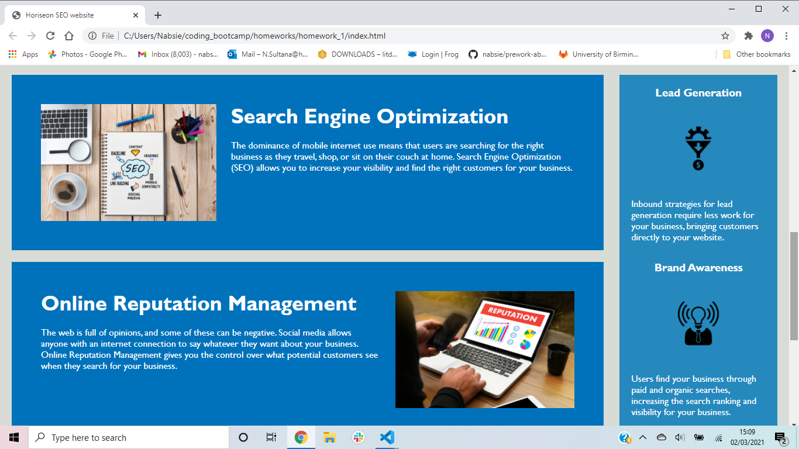
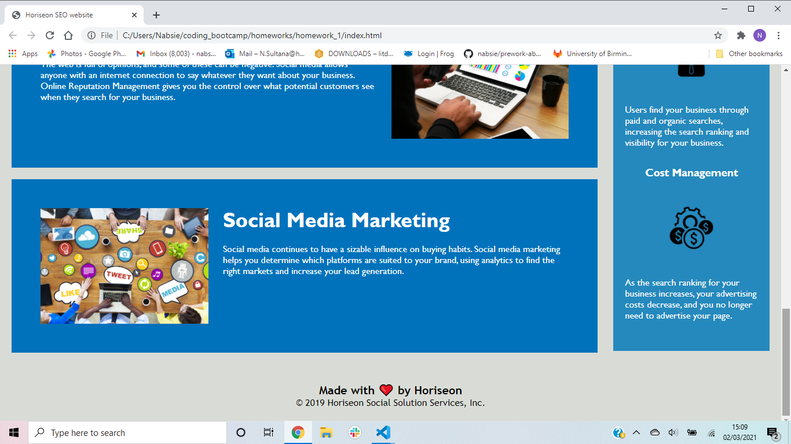

# Homework 1 Horiseon refactor

## Description

### What we did

Problems with the page:

- the 'search engine optimisation' link didn't work - needed an id attribute
- CSS was ordered badly - reordered to match html file
- html header tags were not ordered correctly - went from h1 to h5

For this assignment I changed:

- The html to follow semantic html. For example, I added in header and footer tags along with changing div tags to nav tags or main or section or aside tags.

- I also added alt attributes to the images to make them descriptive on screen readers

- added comments to html and css file to make it user friendly

- I also grouped together certain selectors in the css file to make it neater

For future reference I would make the links head to an external page where more information can be shared.

## Screenshots





## link to deployed application

```
git clone git@github.com:nabsie/homework_1.git
code .
```

https://nabsie.github.io/homework_1/
